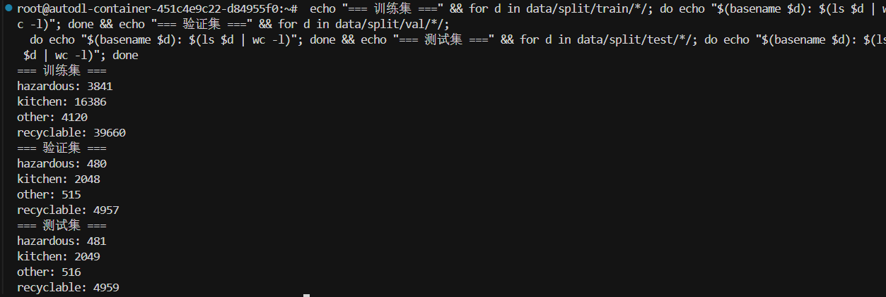
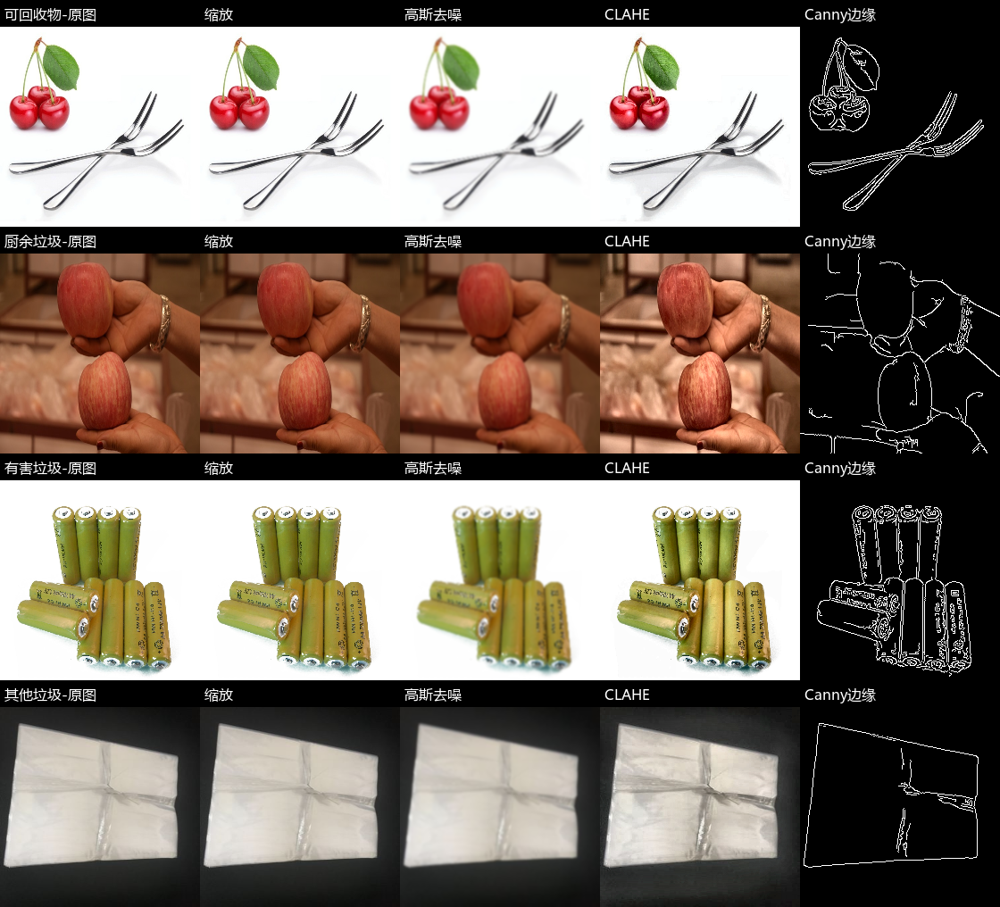
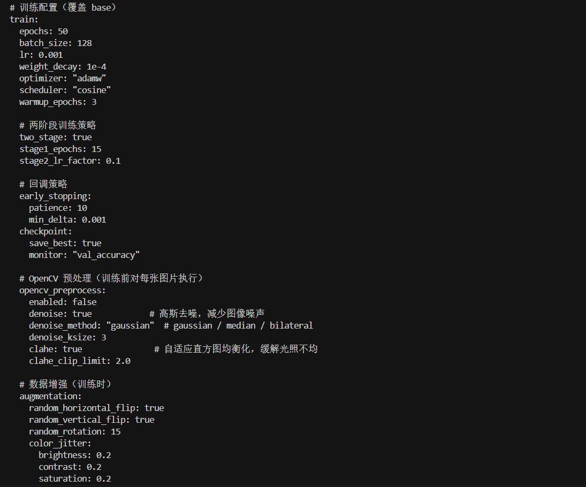
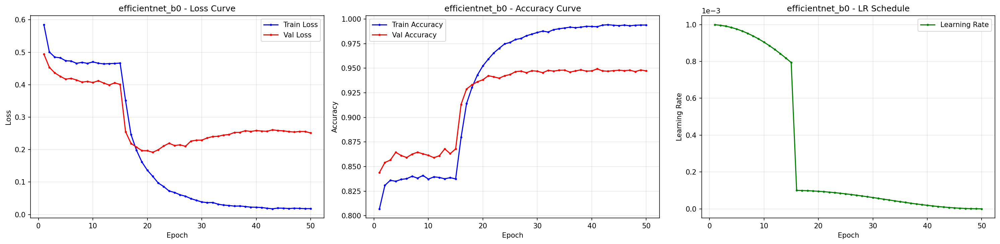
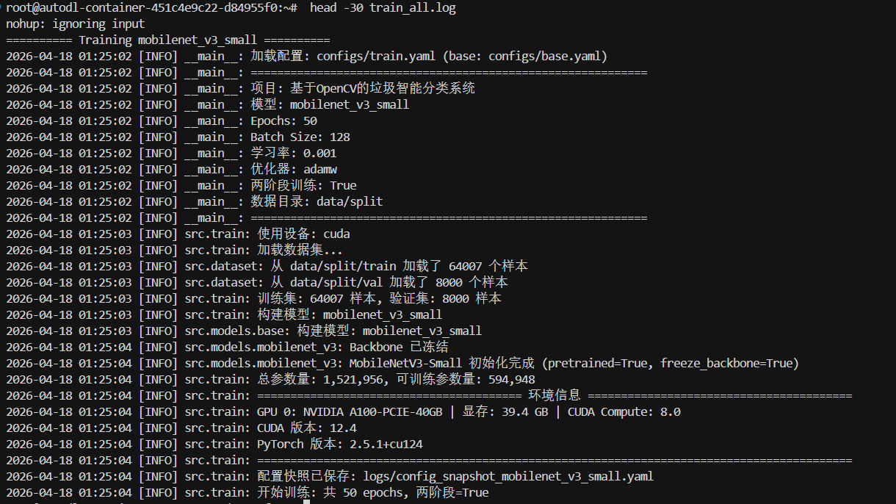
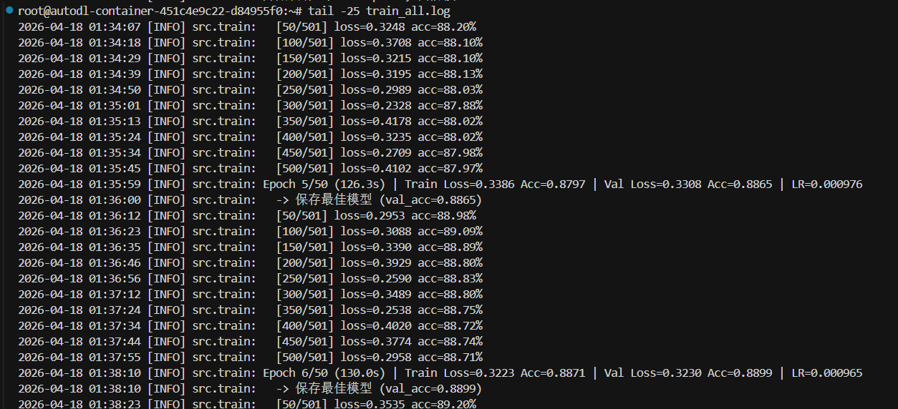
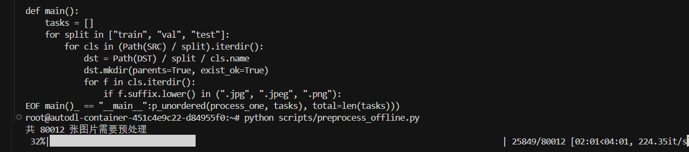
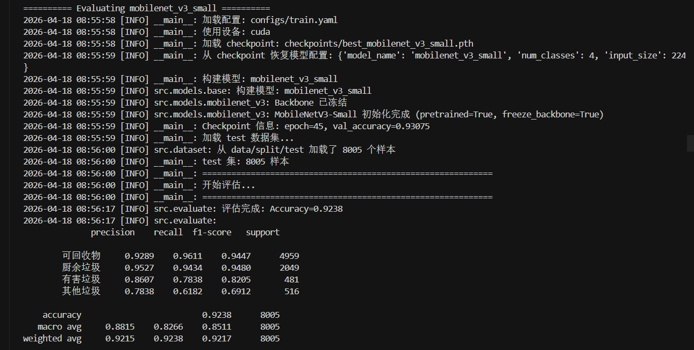

# 摘 要

随着垃圾分类制度在校园、社区和公共服务场景中的持续推进，依赖人工经验进行垃圾辨识和投放指导的方式逐渐暴露出效率低、标准不统一和误判率较高等问题。针对垃圾图像类别间差异细微、背景复杂、样本分布不均衡以及系统演示需求明确等特点，本文围绕“基于 OpenCV 的垃圾智能分类系统”开展设计与实现工作，形成了一套兼顾算法效果与工程落地的垃圾图像四分类方案。

本文以当前已完成的 PyTorch + OpenCV 四分类工程为研究对象，结合项目真实训练结果和系统实现过程展开论文撰写。系统首先对来源于 245 个细分类别的 80012 张垃圾图像进行统一整理，依据生活垃圾分类规则将其映射为可回收物、厨余垃圾、有害垃圾和其他垃圾四大类，并采用 8:1:1 的分层方式构建训练集、验证集和测试集。围绕题目中 OpenCV 的核心定位，本文设计并实现了图像去噪、CLAHE 自适应直方图均衡化、颜色空间转换、数据增强、结果可视化和摄像头视频采集等模块。在模型层面，构建了 MobileNetV3-Small、ResNet18、EfficientNet-B0 和 ShuffleNetV2 四种候选网络，并采用预训练迁移学习和“两阶段训练”策略完成模型优化。

在工程实现方面，项目已经完成数据整理脚本、OpenCV 预处理模块、模型注册机制、训练引擎、评估引擎、单图推理、摄像头实时识别脚本，以及基于 FastAPI 的多标签页 Web 演示界面。该界面支持首页概览、单图识别、四模型实时对比、批量识别统计和 OpenCV 预处理管线可视化，实现了从数据准备、模型训练到前端交互展示的完整闭环。实验结果表明，在第二轮含 OpenCV 预处理的正式训练中，EfficientNet-B0 在测试集上取得了 94.47% 的准确率、91.64% 的宏平均精确率、87.70% 的宏平均召回率和 89.54% 的宏平均 F1 值，综合性能优于其余三种模型。离线 OpenCV 预处理将单个 epoch 的训练耗时由约 400 s 降低至约 130 s，显著提升了训练效率。

研究结果表明，将 OpenCV 图像处理技术与深度学习分类模型有机结合，不仅能够提升垃圾分类系统在复杂场景下的可用性，还能增强系统的工程完整性和论文支撑材料的丰富度。本文的研究与实现可为校园垃圾分类宣传、社区投放指导、智能垃圾桶前端识别等应用场景提供参考。

**关键词**：垃圾分类；OpenCV；图像识别；迁移学习；EfficientNet-B0；智能分类系统

\newpage

# Abstract

With the continuous promotion of municipal waste sorting policies, traditional manual identification and disposal guidance can hardly satisfy the practical requirements of efficiency, consistency, and low error rate. To address the challenges of subtle inter-class differences, complex backgrounds, imbalanced samples, and real demonstration requirements in waste image classification, this thesis designs and implements an intelligent waste classification system based on OpenCV.

The thesis is written based on the completed PyTorch and OpenCV engineering project rather than on a conceptual prototype. A total of 80,012 images from 245 fine-grained categories are reorganized and merged into four classes, namely recyclable waste, kitchen waste, hazardous waste, and other waste. The dataset is then split into training, validation, and test sets with a stratified ratio of 8:1:1. Around the core role of OpenCV in the thesis topic, modules for image denoising, CLAHE enhancement, color-space conversion, data augmentation, result visualization, and camera-based video acquisition are implemented. On the model side, four candidate networks are constructed, including MobileNetV3-Small, ResNet18, EfficientNet-B0, and ShuffleNetV2, and a two-stage transfer learning strategy is adopted for optimization.

From the perspective of system implementation, the project has completed data preparation scripts, OpenCV preprocessing modules, model registration, training and evaluation engines, single-image inference, real-time camera recognition, and a FastAPI-based multi-tab Web interface. The interface supports homepage overview, single-image recognition, real-time four-model comparison, batch prediction statistics, and OpenCV pipeline visualization, thus establishing a complete workflow from data preparation and model training to frontend interaction. Experimental results show that EfficientNet-B0 achieves the best overall performance in the second-round training with OpenCV preprocessing, reaching 94.47% accuracy, 91.64% macro precision, 87.70% macro recall, and 89.54% macro F1-score on the test set. In addition, offline OpenCV preprocessing reduces the training time per epoch from about 400 seconds to about 130 seconds.

The results indicate that combining OpenCV-based image processing with deep learning classification models can effectively improve both the practical performance and the engineering completeness of waste classification systems. The work of this thesis can provide a useful reference for campus waste sorting, community guidance, and intelligent waste-bin front-end recognition applications.

**Key words**: waste classification; OpenCV; image recognition; transfer learning; EfficientNet-B0; intelligent classification system

\newpage

# 第一章 绪论

## 1.1 研究背景与意义

近年来，生活垃圾分类已从宣传倡导阶段逐步进入制度化、常态化实施阶段。无论是在校园、社区还是公共服务区域，垃圾分类都面临一个共同问题，即普通用户往往缺乏稳定、准确的分类判断能力。面对饮料瓶、剩饭剩菜、废电池、污染纸巾等不同类别垃圾时，用户容易因主观经验不足或场景复杂而产生误投行为。这类问题不仅降低前端分类质量，还会增加后端回收和分拣成本。

随着计算机视觉与深度学习的发展，基于图像识别的垃圾智能分类方案成为提升前端分类效率的重要技术方向。相较于依赖人工规则的传统方案，深度学习模型能够自动提取图像中的边缘、纹理和语义特征，在复杂背景和多样外观条件下保持较好的分类能力。同时，OpenCV 在图像读取、预处理、摄像头视频采集和结果可视化等方面具有成熟稳定的工程优势，适合作为毕业设计中“系统实现”与“工程工作量”的核心支撑模块。

因此，研究并实现一套基于 OpenCV 的垃圾智能分类系统，既具有明确的现实应用价值，也具有较强的工程实践意义。一方面，该系统可服务于垃圾投放指导、垃圾分类宣传和智能垃圾桶前端识别等场景；另一方面，系统化完成从数据准备、模型训练到界面演示的完整工程闭环，能够充分体现毕业设计对算法设计、软件实现和实验分析三方面能力的综合要求。

## 1.2 国内外研究现状

围绕垃圾图像分类与智能垃圾分拣系统的研究，国内外学者已从深度学习分类、机器视觉分拣和系统集成三个方向开展了较多探索。总体来看，国内研究更强调面向具体应用场景的系统设计与工程实现，国外研究则更重视方法综述、算法泛化能力以及分类结果与管理链路的联动分析。

国内研究方面，陈佳[1]围绕深度学习垃圾智能分类方法展开研究，重点关注垃圾图像识别任务中的模型选择、分类方法与实验验证问题，为垃圾分类任务中采用深度神经网络替代传统手工特征方法提供了参考。王文武[2]从“智能垃圾分类系统设计与实现”的角度出发，强调了垃圾分类算法与前端演示系统之间的协同关系，体现了毕业设计类课题中“算法 + 系统”一体化实现的研究路径。冯昊昊[3]在垃圾分类基础上进一步引入投放点定位这一应用需求，说明垃圾分类研究已经从单一图像识别逐步延伸到投放管理与场景化应用。李金玉[4]则从垃圾图像分类方法与系统构建两个层面展开分析，对模型方法、系统框架以及实验验证进行了较系统的讨论。徐猛[5]聚焦可回收垃圾分类问题，体现了针对特定子类开展细粒度识别研究的思路。梁旭东[6]围绕智能垃圾分类系统的整体研究展开，说明深度学习在垃圾分类系统中的应用已经逐步从方法验证转向系统工程化实现。

在机器视觉系统设计方向，周杰豪等[7]提出了一种基于机器视觉的智能垃圾分类箱设计方案，研究重点更偏向前端感知设备与分类箱体的系统集成，体现了机器视觉技术在垃圾分类硬件终端中的应用价值。王业伟[8]则从机器视觉与智能生活垃圾分拣系统设计角度出发，更强调识别模块与分拣执行模块的联动关系。这类研究说明，垃圾分类任务并不仅是一个纯粹的图像分类问题，还涉及设备形态、交互方式和后续处理流程等工程因素。

国外研究方面，Yevle 和 Mann[9]对人工智能在废弃物管理分类中的应用进行了系统综述，归纳了数据集、评价指标、关键技术路线以及未来发展方向，并指出数据质量、算法偏差、隐私保护和系统可解释性仍是 AI 垃圾分类系统面临的重要问题。这类综述研究为本文理解垃圾分类任务的技术边界与研究趋势提供了宏观视角。Ishaque 和 Florence[10]则提出了将深度学习分类与车辆路径优化相结合的 municipal solid waste management 方案，其公开摘要显示，该研究将深度学习垃圾分类与后续运输决策联系起来，体现了垃圾分类模型向管理决策链路延伸的应用潜力。

综合现有研究可以发现，国内外文献已经证明深度学习和机器视觉技术能够有效提升垃圾分类任务的自动化水平，但仍存在三方面不足：第一，不少研究重点放在分类模型或设备方案本身，对 OpenCV 预处理模块的独立设计和系统化展示不够充分；第二，多数研究更关注单模型精度，较少从多模型对比、推理耗时和交互界面三个维度联合分析系统性能；第三，能够同时覆盖数据准备、OpenCV 预处理、模型训练、结果可视化和 Web 演示的完整工程链路研究仍然不足。本文正是在上述研究基础上，尝试构建一套更完整的“OpenCV + 深度学习 + 多功能界面”的垃圾智能分类系统。

## 1.3 本文的主要工作

围绕“基于 OpenCV 的垃圾智能分类系统”的设计与实现，本文结合当前项目真实完成内容，主要完成了以下工作。

（1）对 245 个细分类别、共 80012 张垃圾图像进行统一梳理，并根据中文目录前缀映射为四大类垃圾，生成可复用的标签映射、类别统计和数据划分元数据。

（2）设计并实现了以 OpenCV 为核心的图像预处理模块，包括高斯去噪、CLAHE 自适应直方图均衡化、颜色空间转换、结果绘制和摄像头采集等功能。

（3）构建 MobileNetV3-Small、ResNet18、EfficientNet-B0 和 ShuffleNetV2 四种候选模型，采用模型注册机制统一管理，并基于迁移学习完成四分类任务训练。

（4）实现了包含 EarlyStopping、余弦退火学习率调度、训练日志导出、训练曲线绘制和最佳权重保存的训练引擎，以及输出 Accuracy、Precision、Recall、F1、混淆矩阵和错分样本的评估引擎。

（5）完成了单图识别、摄像头实时识别和基于 FastAPI 的 Web 界面，实现多模型切换、分类结果展示、概率分布显示和垃圾投放建议提示。

（6）基于两轮训练结果对系统性能进行实验分析，形成了能够直接支撑论文撰写的表格、曲线图、混淆矩阵和训练过程截图材料。

## 1.4 论文结构安排

本文共分为六章。第一章阐述研究背景、研究意义、相关研究现状以及本文的主要工作。第二章介绍垃圾图像分类任务涉及的 OpenCV、卷积神经网络、迁移学习和系统开发关键技术。第三章围绕垃圾智能分类系统总体设计展开，重点介绍系统架构、核心模块、数据集构建、四分类映射与 OpenCV 预处理方案。第四章重点说明候选模型设计、模型注册机制、两阶段训练策略和训练参数设置。第五章介绍数据处理、训练评估、推理引擎以及多标签页 Web 界面的具体实现。第六章结合真实训练日志、评估报告、界面演示与误分类样例，对多模型实验结果、训练过程、推理速度和系统功能效果进行分析。最后给出全文结论与后续展望。

\newpage

# 第二章 相关技术基础

## 2.1 OpenCV 图像处理技术

OpenCV 是当前应用最广泛的计算机视觉基础库之一，具有图像读写、颜色空间转换、滤波去噪、边缘检测、几何变换、视频流采集和结果绘制等功能。在本文中，OpenCV 并非仅用于辅助读取图片，而是承担了系统中多个关键工程环节：训练前图像质量增强、推理阶段图片解码、摄像头视频帧采集、分类结果叠加显示，以及论文插图所需的可视化材料生成。

结合项目实际实现，本文主要使用 OpenCV 完成以下处理流程：首先通过 `cv2.imread` 读取 BGR 图像；随后使用高斯滤波降低拍摄噪声和压缩伪影；再将图像转换到 LAB 空间，仅对亮度通道执行 CLAHE 增强，以提升暗光和光照不均条件下的局部对比度；最后将图像转回 RGB，并交由深度学习模型继续处理。该流程兼顾了图像质量改善和颜色信息保留，对垃圾图像中材质边界模糊、背景干扰较强的问题具有明显帮助。

从理论角度看，高斯滤波本质上是利用二维高斯函数对邻域像素进行加权平均，其核函数可表示为：

$$
G(x,y)=\frac{1}{2\pi\sigma^2}\exp\left(-\frac{x^2+y^2}{2\sigma^2}\right)
$$

其中，$x$ 与 $y$ 表示像素点相对卷积核中心的位置，$\sigma$ 表示高斯分布标准差。该公式说明，距离中心越近的像素权重越大，因此高斯滤波能够在平滑噪声的同时尽量保持图像主体结构。

除预处理外，OpenCV 还支撑了系统可视化工作。项目通过 `draw.py` 将中文类别名称、置信度和概率条形图绘制到结果图片上，并通过 `camera.py` 封装摄像头读取与帧率控制逻辑，为实时识别演示提供了基础。可以说，OpenCV 构成了本文工程实现中最具“可见工作量”的模块之一。

## 2.2 卷积神经网络与迁移学习

卷积神经网络能够通过卷积层、归一化层、激活函数和池化层逐级提取图像中的低层和高层语义特征，因此特别适合垃圾图像这种类别间差异复杂、背景变化明显的视觉任务。与传统手工特征方案相比，卷积神经网络不依赖人为设计特征表达，而是通过大规模数据训练自动学习分类所需的判别性特征。

在垃圾分类任务中，不同类别之间既存在形状差异，也存在材质和颜色上的交叉。例如，部分可回收物和其他垃圾都可能呈现塑料材质，厨余垃圾和其他垃圾中也可能出现褐色、灰色、浅黄色等相近色调。卷积神经网络通过多层特征提取机制，能够较好地融合局部纹理和整体结构信息，从而提高对复杂样本的识别能力。

由于本项目虽然拥有 80012 张图片，但仍属于特定领域数据集，直接从头训练深层网络不仅成本较高，而且容易出现收敛速度慢和泛化能力不足的问题。为此，本文采用迁移学习策略，直接使用 ImageNet 预训练权重初始化各候选模型，仅替换最终分类层为 4 类输出，再针对垃圾分类数据集进行微调。这种做法既能保留通用视觉特征，又能缩短训练时间，是本文模型训练的重要技术基础。

## 2.3 轻量化模型与工程部署

垃圾智能分类系统除了追求分类精度外，还必须兼顾部署效率和交互体验。在答辩演示或普通设备使用场景中，模型推理过慢会直接影响系统可用性。因此，本文在模型选型阶段同时考察经典模型和轻量化模型，形成“精度优先 + 轻量化对照”的实验设计思路。

其中，ResNet18 作为经典残差网络，训练稳定、结构成熟；EfficientNet-B0 通过统一的宽度、深度和分辨率复合缩放，具有较高的参数利用率；MobileNetV3-Small 融合倒残差结构与注意力机制，更适合资源受限场景；ShuffleNetV2 则通过通道混洗降低计算代价。多模型对比不仅提升了论文实验的完整性，也为系统后续按精度或速度需求切换模型提供了依据。

## 2.4 系统开发关键技术

在软件工程层面，本文项目采用 Python 作为统一开发语言，深度学习框架使用 PyTorch 2.5.1，图像处理使用 OpenCV 4.12.0，评估指标计算依赖 scikit-learn，前端演示采用 FastAPI + HTML + CSS + JavaScript 的组合方式。与单纯的算法实验不同，本系统还通过 YAML 配置文件管理训练参数和数据路径，降低了模块耦合度，提高了实验复现性。

项目中各功能模块通过清晰的分层方式组织。数据层负责原始数据整理和四分类标签映射；算法层负责模型构建、训练和评估；OpenCV 层负责图像预处理、增强、摄像头和结果可视化；应用层负责单图推理、实时识别和 Web 交互界面。这种分层结构既方便后续维护，也方便论文从“系统设计”和“系统实现”两个维度展开描述。

## 2.5 本章小结

本章围绕垃圾智能分类系统涉及的关键技术展开介绍，重点说明了 OpenCV 在图像处理和工程展示中的作用、卷积神经网络与迁移学习在分类任务中的优势，以及轻量化模型和分层架构对系统落地的重要意义。这些内容为后续的系统设计、模型训练和实验分析奠定了技术基础。

\newpage

# 第三章 垃圾智能分类系统总体设计

## 3.1 系统总体设计

为保证论文内容与当前项目完全一致，本文以已完成的 PyTorch 四分类主线工程为研究对象，不再沿用早期 245 类 TensorFlow 版本作为论文主体。系统整体围绕“数据准备 - OpenCV 处理 - 深度学习推理 - 结果展示”展开，形成了从后端训练到前端演示的完整技术闭环。

系统可概括为四层结构：数据层负责 245 类数据归并和训练集、验证集、测试集划分；图像处理层负责 OpenCV 预处理、增强和摄像头采集；模型层负责候选网络构建、训练与评估；应用层负责单图识别、模型对比、批量识别、OpenCV 演示和 Web 交互展示。该结构既体现了论文题目中的 OpenCV 核心地位，也保证了模型训练、系统推理与前端演示之间的良好衔接。

系统的业务流程可概括为：用户输入图片或实时视频后，OpenCV 模块首先完成图像读取、尺寸调整与预处理；随后由深度学习模型输出四分类结果；最后系统结合概率分布与可视化模块，在 Web 界面或实时识别窗口中展示分类结果。为使流程表达更加规范，本文将该处理链路整理为如图 3-1a 所示的系统流程图。

{ width=78% }

系统已形成较完整的模块实现，具体如表 3-1 所示。

| 模块 | 主要功能 | 功能描述 |
|------|----------|----------|
| 数据处理模块 | 245 类归并、划分数据集、生成元数据 | 支持根据中文目录前缀完成四分类映射，并自动生成标签映射、类别分布和数据划分元数据。 |
| OpenCV 预处理模块 | 去噪、CLAHE、颜色转换、预处理可视化 | 支持高斯去噪与 CLAHE 增强，并输出预处理流程图与中间结果，用于训练前增强和论文插图生成。 |
| 数据增强模块 | 翻转、旋转、颜色扰动、随机擦除 | 支持训练阶段的几何增强和颜色增强，以提升模型对拍摄角度和光照变化的鲁棒性。 |
| 模型构建模块 | 多模型统一构建与切换 | 支持 MobileNetV3-Small、ResNet18、EfficientNet-B0 和 ShuffleNetV2 的统一注册与调用。 |
| 训练引擎 | 两阶段训练、早停、日志记录 | 支持两阶段迁移学习、EarlyStopping、训练日志导出和最佳权重自动保存。 |
| 评估引擎 | 计算指标、混淆矩阵、错分样本 | 支持输出总体指标、分类报告、混淆矩阵和错分样例，为实验分析提供依据。 |
| 推理引擎 | 单图预测、批量预测 | 支持单图推理与批量推理，输出类别概率、置信度和投放建议。 |
| 模型对比模块 | 四模型同图对比推理 | 支持同一张图片在四种模型上的并行推理与耗时展示，用于精度与速度比较。 |
| 批量识别模块 | 多图上传批量推理 | 支持多张图片集中识别，并提供类别分布与置信度统计结果。 |
| OpenCV 可视化模块 | 预处理管线逐步展示 | 支持原图、去噪、CLAHE 增强和模型输入四个步骤的可视化展示。 |
| 历史记录模块 | 浏览器本地历史保存 | 基于 localStorage 保存最近 20 条识别历史，便于结果回看与交互演示。 |
| Web 展示模块 | 多标签页界面与结果呈现 | 支持首页概览、智能识别、批量识别和 OpenCV 演示等多入口交互。 |

Table: 表 3-1 系统核心模块与功能描述

## 3.2 数据集构建与四分类映射

本项目的数据集来源于 245 个细分类别的垃圾图像目录，总图片数为 80012 张。原始目录采用“`大类_小类`”的命名方式，例如“厨余垃圾_苹果”“可回收物_书”“有害垃圾_电池”等。为了与当前生活垃圾四分类制度保持一致，同时降低模型输出复杂度，本文将全部 245 个细分类别统一映射为四个一级类别，即可回收物、厨余垃圾、有害垃圾和其他垃圾。

从类别构成上看，可回收物包含 136 个子类，共 49576 张图片；厨余垃圾包含 48 个子类，共 20483 张图片；有害垃圾包含 14 个子类，共 4802 张图片；其他垃圾包含 47 个子类，共 5151 张图片。可以看出，数据集具有明显的不平衡特征，可回收物样本约占总数的 62.0%，而有害垃圾和其他垃圾占比均不足 7%。这一特点对模型训练中的召回率和错误分类分布有直接影响，因此需要在实验分析中重点关注小类别表现。

为了保证训练、验证和测试的统计一致性，项目采用分层抽样方式按 8:1:1 比例划分数据集。最终形成训练集 64007 张、验证集 8000 张、测试集 8005 张，其中各大类样本数如表 3-2 所示。

| 类别 | 总数 | 训练集 | 验证集 | 测试集 |
|------|-----:|------:|------:|------:|
| 可回收物 | 49576 | 39660 | 4957 | 4959 |
| 厨余垃圾 | 20483 | 16386 | 2048 | 2049 |
| 有害垃圾 | 4802 | 3841 | 480 | 481 |
| 其他垃圾 | 5151 | 4120 | 515 | 516 |
| 合计 | 80012 | 64007 | 8000 | 8005 |

Table: 表 3-2 数据集四分类划分结果

{ width=78% }

## 3.3 OpenCV 预处理与增强设计

结合垃圾图像在实际场景中的拍摄特点，本文在训练和推理链路中均引入了 OpenCV 预处理模块。其核心目标有两个：一是减少模糊、噪声、光照不均等因素对模型输入质量的影响；二是突出 OpenCV 在毕业设计中的独立工程价值。当前项目中正式启用的预处理包括高斯去噪和 CLAHE 自适应直方图均衡化，其中高斯核大小为 3×3，CLAHE 的 `clipLimit` 为 2.0。

具体处理流程如下：首先读取 BGR 图像；随后执行高斯滤波以减轻局部噪声和压缩痕迹；再将图像转换到 LAB 颜色空间，仅对亮度通道执行 CLAHE 增强，以提升暗光和光照不均条件下的局部对比度；处理完成后再转回 BGR 或 RGB 形式，交给后续的深度学习预处理流程。该方法能够在增强局部纹理的同时保留色彩信息，对垃圾图像中的边缘细节和材质反射区域有较好的改善作用。

从实现角度看，该预处理链路并非简单串联滤波函数，而是遵循“先降低噪声、再增强亮度通道局部对比度”的处理顺序。其中，高斯去噪负责削弱图像采集中的随机噪声与压缩伪影，CLAHE 则在 LAB 颜色空间的 L 通道上增强细节层次，从而在不明显破坏色彩信息的前提下改善目标边缘与材质反射区域的可分辨性。

在数据增强方面，训练阶段使用随机水平翻转、随机垂直翻转、±15° 随机旋转、亮度/对比度/饱和度扰动以及随机擦除等方法，以提升模型对视角变化、遮挡和光照波动的适应能力。项目中 OpenCV 与 `torchvision` 增强并行存在，其中 OpenCV 更偏向预处理与可视化展示，而主训练链路中的在线增强由 `torchvision.transforms` 实现。

除最终启用的高斯去噪与 CLAHE 外，项目中的 OpenCV 模块还集成了中值滤波、双边滤波、Canny/Sobel/Laplacian 边缘检测、亮度与对比度调整、HSV 颜色空间操作等功能。这些功能虽然未全部纳入最终训练配置，但已在 `src/opencv_pipeline/preprocess.py` 中实现，并通过 OpenCV 演示页和预处理可视化图形成可展示的工程成果。这一设计说明，本文并非只把 OpenCV 作为简单读图工具，而是将其构建为面向训练、推理和演示的一体化图像处理模块。

{ width=82% }

## 3.4 系统设计难点分析

从项目实际实施过程看，系统设计的难点主要体现在以下几个方面。第一，数据类别极不均衡，小样本类别更容易被可回收物和厨余垃圾覆盖，导致宏平均指标与总体准确率之间存在差距。第二，垃圾图像背景复杂，拍摄过程中常出现桌面纹理、塑料袋、容器边缘、阴影与高光反射等干扰。第三，系统不仅要输出较高精度的分类结果，还要具备一定的实时性和可视化展示能力，以满足答辩场景下的演示需求。第四，论文题目明确强调 OpenCV，因此 OpenCV 模块必须从“辅助工具”提升为“独立设计内容”，并形成可展示的中间结果与技术材料。

针对以上问题，本文通过四分类标签重构、OpenCV 预处理、四模型对照实验、两阶段训练和多端推理展示等方式逐步解决，最终形成了兼顾算法效果与工程完整性的系统设计方案。

## 3.5 本章小结

本章从系统整体架构、数据集构建、四分类映射、OpenCV 预处理和系统设计难点等方面对垃圾智能分类系统进行了设计分析。通过对项目真实数据与模块实现进行归纳，可以看出当前系统已经具备较完整的研究与实现基础，为后续模型训练与实验分析提供了可靠支撑。

\newpage

# 第四章 垃圾分类模型的研究与优化

## 4.1 候选模型选择策略

为避免论文只停留在单模型实验层面，本文在模型设计阶段引入了四种具有代表性的卷积神经网络作为候选模型，分别是 MobileNetV3-Small、ResNet18、EfficientNet-B0 和 ShuffleNetV2。四种模型分别对应轻量化部署、经典残差基线、高参数利用率和高实时性等不同目标，既有利于开展多模型对比实验，也便于从工程角度分析精度与体积之间的平衡关系。

从当前项目结果来看，EfficientNet-B0 在整体测试性能上表现最好，因此被确定为本文最终主力模型；ResNet18 则作为稳定的精度基线；MobileNetV3-Small 和 ShuffleNetV2 更适合作为轻量化方案对照。表 4-1 给出了四种模型的定位及其在本项目中的作用。

| 模型 | 定位 | 主要特点 | 当前作用 |
|------|------|----------|----------|
| MobileNetV3-Small | 轻量化候选 | 倒残差结构与注意力机制结合 | 轻量部署对照 |
| ResNet18 | 经典基线 | 残差连接稳定、训练成熟 | 基线精度模型 |
| EfficientNet-B0 | 主力模型 | 复合缩放、参数利用率高 | 最终最优模型 |
| ShuffleNetV2 | 实时性候选 | 通道混洗、推理较快 | 速度对照模型 |

Table: 表 4-1 候选模型选择策略

## 4.2 模型统一构建与注册机制

为提升代码结构的可维护性，项目没有为每个模型单独编写完全独立的训练流程，而是采用模型注册机制统一管理模型构建逻辑。各候选模型在定义时统一注册到全局模型表中，训练脚本只需根据配置文件中的模型名称调用构建函数，即可实例化对应网络。该设计既减少了训练脚本中的条件分支，也为后续扩展新模型预留了清晰接口。

从工程组织角度看，模型注册机制具有两方面优势：其一，不同模型在训练入口层面共享统一调用方式，便于进行多模型对比实验；其二，模型名称、输入尺寸、类别数和预训练权重等参数均由配置文件统一管理，从而实现“配置驱动”的实验组织方式。通过这种设计，项目能够在较低维护成本下同时管理 EfficientNet-B0、ResNet18、MobileNetV3-Small 和 ShuffleNetV2 四个候选模型，并保持训练、评估和推理流程的一致性。

## 4.3 两阶段迁移学习训练策略

迁移学习是本文模型训练的关键策略。针对垃圾图像任务与 ImageNet 通用图像任务之间既有相似性又有差异性的特点，本文采用“两阶段训练”方式完成模型微调。第一阶段冻结 backbone，仅训练新替换的分类头，以快速适应四分类任务；第二阶段解冻主干网络，并将学习率缩小为初始值的 0.1 倍，对全网络进行细粒度微调。

项目中第一阶段设置为前 15 个 epoch，第二阶段为第 16 至 50 个 epoch。训练引擎在进入第二阶段时自动调用 `unfreeze_backbone()` 解冻骨干网络，并重建优化器，以保证学习率切换逻辑清晰可控。从 EfficientNet-B0 的训练日志可见，该策略在切换阶段带来了明显的性能跃升：第 15 个 epoch 时验证准确率为 86.80%，第 16 个 epoch 进入微调阶段后迅速提升至 91.33%，说明预训练特征与微调策略在本任务中是有效的。

在具体实现中，训练引擎会在第 16 个 epoch 自动切换到微调阶段：首先解除骨干网络参数冻结状态，然后将学习率按 `stage2_lr_factor` 缩小，再重新构建优化器，以保证阶段切换后的训练过程稳定可控。为避免代码片段打断论文行文，本文将该策略整理为如图 4-2 所示的示意图。

{ width=86% }

## 4.4 训练参数设置

当前项目的正式训练配置如表 4-2 所示。训练统一采用 224×224 输入尺寸、50 个 epoch、批量大小 128、AdamW 优化器和余弦退火学习率调度；同时结合 EarlyStopping 防止无效训练持续进行。验证集和测试集沿用与训练一致的 OpenCV 预处理流程，以确保输入分布一致。

| 参数 | 数值 | 说明 |
|------|-----|------|
| 输入尺寸 | 224×224 | 所有模型统一 |
| 批量大小 | 128 | 训练和验证阶段统一 |
| 训练轮次 | 50 | 含两阶段训练 |
| 初始学习率 | 0.001 | AdamW 优化器 |
| 权重衰减 | 1e-4 | 减轻过拟合 |
| 学习率调度 | CosineAnnealingLR | 平滑衰减 |
| 阶段一轮次 | 15 | 冻结骨干网络 |
| 阶段二学习率因子 | 0.1 | 解冻后学习率下降 |
| 早停耐心值 | 10 | 监控验证准确率 |
| 数据加载线程数 | 8 | 提升读图效率 |

Table: 表 4-2 训练超参数设置

在损失函数方面，系统使用交叉熵损失衡量预测分布与真实标签之间的差异，其定义为：

$$
\mathcal{L}_{CE}=-\sum_{i=1}^{C} y_i \log(\hat{y}_i)
$$

其中，$C$ 表示类别数，$y_i$ 为真实标签的 one-hot 编码，$\hat{y}_i$ 为模型对第 $i$ 类的预测概率。对于本文的四分类任务，交叉熵损失能够直接反映模型输出与真实类别之间的匹配程度。

优化器采用 AdamW，其参数更新形式可表示为：

$$
\theta_{t+1}=\theta_t-\eta\cdot\frac{m_t}{\sqrt{v_t}+\epsilon}-\eta\lambda\theta_t
$$

其中，$\theta_t$ 为第 $t$ 次迭代的模型参数，$\eta$ 为学习率，$m_t$ 与 $v_t$ 分别表示一阶矩估计和二阶矩估计，$\lambda$ 表示权重衰减系数。AdamW 的优势在于将权重衰减项与梯度更新项解耦，使训练过程更加稳定。

学习率调度方面，项目使用 CosineAnnealingLR，其典型形式为：

$$
\eta_t=\eta_{min}+\frac{1}{2}(\eta_{max}-\eta_{min})\left(1+\cos\frac{t\pi}{T_{max}}\right)
$$

其中，$\eta_t$ 为第 $t$ 个 epoch 的学习率，$T_{max}$ 为余弦退火周期。该策略能够在训练后期平滑降低学习率，有助于模型在局部最优附近进行更精细的参数搜索。

{ width=76% }

## 4.5 本章小结

本章对候选模型选型依据、模型注册机制、两阶段迁移学习策略和训练参数设置进行了说明。通过统一模型接口和配置驱动方式，项目能够在较低维护成本下完成四种网络的对比实验；通过两阶段训练策略，则有效提升了模型对垃圾四分类任务的适应能力，为后续实验结果分析奠定了基础。

\newpage

# 第五章 垃圾智能分类系统实现与界面设计

## 5.1 数据处理与训练评估流程实现

系统实现首先从数据处理模块展开。项目通过数据整理脚本扫描 245 个原始子文件夹，依据文件夹名前缀自动完成四分类映射，并生成 `label_map`、`class_distribution` 和 `split_info` 等元数据文件。这些元数据既服务于训练脚本，也为论文中的数据统计表提供了可靠依据。与仅手工整理目录的方式相比，脚本化处理显著提高了数据准备的可重复性。

在训练流程上，系统通过统一入口脚本自动完成配置加载、随机种子设置、数据集构建、模型初始化、训练循环、最佳权重保存和曲线图导出。训练过程中会记录每个 epoch 的训练损失、训练准确率、验证损失、验证准确率、学习率变化和耗时信息，并将结果保存为 CSV 文件。这些日志被进一步用于生成训练曲线图，为论文中的实验过程分析提供了可视化支撑。

评估流程则在测试集上计算总体准确率、宏平均精确率、宏平均召回率和宏平均 F1 值，同时输出各类别的详细指标、混淆矩阵和错分样本。这种设计避免了论文只给出单一 Accuracy 的问题，使实验分析更具说服力。

## 5.2 推理引擎与实时识别实现

项目推理引擎封装为统一的 `WasteClassifier`，支持单张图片预测和批量预测。推理阶段首先读取图片并执行与训练一致的 OpenCV 预处理，再将图像送入当前选定的模型，输出四类概率分布、预测类别和置信度。在结果展示上，系统使用 PIL 解决中文渲染问题，将类别名、置信度和概率条形图叠加到输出图片中，使演示结果更加直观。

对于实时识别场景，系统基于 OpenCV 的 `VideoCapture` 构建摄像头识别脚本。该模块能够持续采集视频帧，对每一帧图像执行预处理和分类推理，并在窗口中叠加类别文字、概率信息和 FPS 指标。相较于仅实现静态图片预测的方案，摄像头实时识别更能体现系统在实际场景中的应用潜力，也是本项目工程完整性的重要体现。

## 5.3 Web 界面设计与交互流程

为了满足答辩演示与交互展示需求，系统实现了基于 FastAPI 的多标签页 Web 界面。前端入口为 `ui/static/index.html`，并由 `script.js`、`compare.js`、`batch.js`、`opencv-demo.js` 和 `history.js` 分别承担主流程控制、模型对比、批量识别、OpenCV 管线展示和历史记录管理等任务。后端则通过 `/api/predict`、`/api/models`、`/api/switch-model`、`/api/compare`、`/api/batch-predict` 和 `/api/opencv-pipeline` 提供统一接口，从而形成“单页多标签 + 多接口协同”的前后端交互结构。

在页面结构上，系统采用四个顶层标签页设计。首页主要承担系统介绍与快速入口功能，展示数据集规模、最佳模型、四类垃圾颜色编码和分类概览信息；智能识别页是核心交互页面，内部又分为“单图识别”和“模型对比”两个子标签，其中单图识别负责上传图片、显示标注图、概率分布和投放建议，模型对比则通过 `/api/compare` 同时调用四个模型，对同图结果、置信度和推理耗时进行横向比较；批量识别页通过 `/api/batch-predict` 支持多图上传，并结合 ECharts 输出类别占比和数量统计；OpenCV 演示页通过 `/api/opencv-pipeline` 逐步展示原图、去噪、CLAHE 增强和模型输入四个阶段的处理结果。

当前 Web 界面的交互流程已经由单一路径上传识别，扩展为多入口、多结果面板的综合式演示结构。用户既可以在首页快速上传图片并自动跳转到识别页，也可以在智能识别页选择单图识别或模型对比模式；对于需要批量统计的场景，可以直接进入批量识别页获取结果汇总；对于需要突出论文题目中 OpenCV 价值的场景，则可进入 OpenCV 演示页观察预处理管线。与此同时，系统基于 localStorage 保存最近 20 条识别历史，使演示过程中的结果回看和交互连续性得到增强。

从界面设计目标看，该多标签页结构兼顾了三种需求：其一，保证答辩场景下的可展示性，使不同功能入口清晰分离；其二，增强实验对比能力，让模型精度与推理耗时能够在同一页面中直观呈现；其三，突出 OpenCV 的系统价值，使预处理不再只是训练前的隐式步骤，而是能够被界面直接感知和解释的显式模块。

## 5.4 系统实现成果总结

从项目当前状态看，系统已经完成了从算法研究到界面展示的主要工作，形成了较完整的毕业设计成果形态。其具体实现成果包括：

（1）完整的数据处理与四分类映射脚本，支持 245 个细分类别向四大类垃圾的统一归并。

（2）基于 OpenCV 的去噪、CLAHE、结果绘制和摄像头采集模块，构建了独立的图像处理链路。

（3）四种候选模型的统一注册、构建与两阶段训练实现，支持 EfficientNet-B0、ResNet18、MobileNetV3-Small 和 ShuffleNetV2 的对照实验。

（4）训练日志、训练曲线、混淆矩阵、分类报告和错分样例的自动导出，为论文实验分析提供了完整材料。

（5）单图推理与摄像头实时识别功能，能够完成本地图片识别和实时视频流分类演示。

（6）四模型实时对比推理功能，通过 `/api/compare` 同步展示四个模型的分类结果、置信度和推理耗时。

（7）批量图片识别与统计分析功能，通过 `/api/batch-predict` 输出结果列表、类别分布和置信度摘要。

（8）OpenCV 预处理管线可视化功能，通过 `/api/opencv-pipeline` 逐步展示原图、去噪、CLAHE 和模型输入过程。

（9）识别历史记录功能，基于浏览器 localStorage 保存最近 20 条识别结果，便于回看与交互展示。

这些成果不仅说明系统已经具备可运行性，也说明论文中的“设计”和“实现”章节能够建立在真实工程基础上，而不是停留在理论设想层面。特别是模型对比、批量识别统计和 OpenCV 管线可视化三项新增功能，使论文能够同时从算法效果、系统交互和工程展示三个维度展开论证。

## 5.5 本章小结

本章从数据处理、训练评估、推理引擎、摄像头识别和 Web 界面五个方面介绍了垃圾智能分类系统的具体实现。当前系统已具备完整的输入、处理、推理和展示能力，能够为论文实验与答辩演示提供稳定支撑。

\newpage

# 第六章 垃圾智能分类系统实验研究

## 6.1 实验环境与评价指标

本文实验采用“本地验证 + 云端正式训练”的方式完成。系统开发、功能调试和少量 epoch 的验证主要在 Windows 11 本地环境下完成，硬件平台为 RTX 3060 Laptop GPU（6GB 显存）；正式训练在 AutoDL 平台租用的 NVIDIA A100-PCIE-40GB 环境中完成，软件环境为 Python 3.12.4、PyTorch 2.5.1 + CUDA 12.4、OpenCV 4.12.0。

在评价指标上，本文使用 Overall Accuracy 衡量总体分类正确率，使用 Macro Precision、Macro Recall 和 Macro F1 反映各类别均衡表现。其中，宏平均指标能够减弱大类别对总体结果的掩盖作用，更适合当前存在明显类别不平衡的数据集。对于垃圾分类系统而言，仅看总体准确率容易高估模型对有害垃圾和其他垃圾等小类样本的识别能力，因此宏平均 F1 是本文实验分析中的重要参考指标。

各评价指标可表示如下。

精确率（Precision）用于衡量被模型判定为正类的样本中，真实属于该类的比例：

$$
\mathrm{Precision}=\frac{TP}{TP+FP}
$$

召回率（Recall）用于衡量真实属于该类的样本中，被模型成功识别出来的比例：

$$
\mathrm{Recall}=\frac{TP}{TP+FN}
$$

F1 值综合反映精确率与召回率之间的平衡关系：

$$
F_1=\frac{2\times \mathrm{Precision}\times \mathrm{Recall}}{\mathrm{Precision}+\mathrm{Recall}}
$$

对于多分类任务中的宏平均 F1，本文采用各类别 F1 值的算术平均形式：

$$
\mathrm{Macro\text{-}F_1}=\frac{1}{C}\sum_{i=1}^{C}F_{1,i}
$$

其中，$TP$、$FP$ 和 $FN$ 分别表示真正例、假正例和假负例，$C$ 表示类别数。该组指标能够较为全面地反映系统在类别不平衡条件下的识别效果。

## 6.2 多模型对比实验结果

在第二轮正式训练中，项目对 MobileNetV3-Small、ResNet18、EfficientNet-B0 和 ShuffleNetV2 四个模型进行了统一训练与测试。测试集总规模为 8005 张，实验结果如表 6-1 所示。

| 模型 | Accuracy/% | Macro Precision/% | Macro Recall/% | Macro F1/% | 权重/MB |
|------|-----------:|------------------:|---------------:|-----------:|--------:|
| MobileNetV3-Small | 92.38 | 88.15 | 82.66 | 85.11 | 17.67 |
| ResNet18 | 93.57 | 90.20 | 85.75 | 87.81 | 128.06 |
| EfficientNet-B0 | 94.47 | 91.64 | 87.70 | 89.54 | 46.39 |
| ShuffleNetV2 | 93.39 | 89.41 | 85.83 | 87.52 | 14.70 |

Table: 表 6-1 四种候选模型在测试集上的总体表现

从总体结果看，EfficientNet-B0 在四项指标上均取得最佳结果，说明其在当前垃圾四分类任务中具有最优的综合判别能力。ResNet18 和 ShuffleNetV2 的表现较为接近，前者略优于后者，但模型文件更大；MobileNetV3-Small 虽然精度略低，但在轻量化部署方面仍具有价值。

为进一步观察各类别识别效果，表 6-2 给出了四种模型在各类别上的 F1 值。可以发现，所有模型在可回收物和厨余垃圾上的表现明显优于有害垃圾和其他垃圾，其中 EfficientNet-B0 在四个类别上均取得最高 F1 值。

| 类别 | MobileNetV3-Small/% | ResNet18/% | EfficientNet-B0/% | ShuffleNetV2/% |
|------|--------------------:|-----------:|------------------:|---------------:|
| 可回收物 | 94.47 | 95.27 | 96.00 | 95.14 |
| 厨余垃圾 | 94.80 | 95.58 | 96.03 | 95.53 |
| 有害垃圾 | 82.05 | 85.01 | 87.67 | 83.73 |
| 其他垃圾 | 69.12 | 75.39 | 78.46 | 75.67 |

Table: 表 6-2 各类别 F1 指标对比

除精度外，系统前端还通过 `/api/compare` 提供了单图多模型推理耗时统计。为保证测量结果更接近实际交互场景，本文在本地 RTX 3060 Laptop 环境中对模型完成预加载后，使用同一张测试图片连续进行多次对比推理，并以 5 次有效结果的平均值作为单张推理耗时，结果如表 6-3 所示。

| 模型 | 参数量/M | 权重/MB | 耗时/ms | Accuracy/% |
|------|---------:|--------:|--------:|-----------:|
| MobileNetV3-Small | 2.5 | 17.67 | 11.9 | 92.38 |
| ResNet18 | 11.7 | 128.06 | 8.2 | 93.57 |
| EfficientNet-B0 | 5.3 | 46.39 | 15.4 | 94.47 |
| ShuffleNetV2 | 2.3 | 14.70 | 12.8 | 93.39 |

Table: 表 6-3 模型精度与单张推理耗时对比

从表 6-3 可以看出，EfficientNet-B0 虽然获得了最高精度，但其单张推理耗时相对更高；ResNet18 在当前本地测试环境下具有较快的推理响应；ShuffleNetV2 和 MobileNetV3-Small 则兼顾较小模型体积与较低延迟。由此可见，不同模型在精度、体积和推理速度之间存在明显权衡关系，前端模型对比功能能够为系统部署场景选择提供直观依据。

{ width=86% }

## 6.3 训练过程分析

结合 EfficientNet-B0 的训练日志可以更直观地观察两阶段训练策略的作用。第 1 个 epoch 时，训练准确率为 80.70%，验证准确率为 84.39%；在冻结骨干网络的第 15 个 epoch，验证准确率提升至 86.80%；当第 16 个 epoch 进入解冻微调阶段后，验证准确率迅速跃升至 91.33%；第 41 个 epoch 达到最佳验证准确率 94.94%；最终第 50 个 epoch 的训练准确率和验证准确率分别为 99.40% 和 94.73%。这说明“先训练分类头、后全网微调”的策略在本项目中起到了明显效果。

从训练速度看，项目第二轮训练采用了离线 OpenCV 预处理策略，即先对约 8 万张图片完成去噪和 CLAHE 增强，再进行正式训练。实际记录表明，该策略将单个 epoch 的训练耗时从约 400 s 降低至约 130 s，训练速度提升约 3 倍。这一结果说明，在大规模图像数据训练场景中，将图像增强中的确定性预处理从在线阶段前移到离线阶段，能够显著降低 CPU 数据准备对 GPU 训练吞吐的限制。

{ width=72% }

{ width=72% }

{ width=72% }

## 6.4 混淆矩阵与误差分析

为了进一步分析模型错误来源，本文以最终最优模型 EfficientNet-B0 为例，结合其第二轮测试集混淆矩阵进行讨论。测试结果显示，可回收物中有 4818 张样本被正确识别，厨余垃圾中有 1958 张样本被正确识别，有害垃圾中有 409 张样本被正确识别，其他垃圾中有 377 张样本被正确识别。相比可回收物和厨余垃圾，其他垃圾和有害垃圾的正确识别数明显更低，说明这两类仍是系统当前的主要难点。

其原因主要有三点。第一，其他垃圾的视觉边界最不稳定，常见样本如污损纸巾、一次性餐具和陶瓷碎片与可回收物或厨余垃圾之间存在材质和形态交叉。第二，有害垃圾样本量相对较少，仅有 4802 张，远少于可回收物的 49576 张，样本不均衡会削弱模型对小类特征的学习能力。第三，部分样本拍摄背景较为复杂，存在遮挡、反光或目标过小的问题，会进一步增加识别难度。

{ width=78% }

为了使误差分析更具直观性，本文进一步结合实际预测结果选取三类典型样例。其中，图 6-8 展示了系统对典型可回收物样本的正确识别结果；图 6-9 和图 6-10 则分别展示了有害垃圾与其他垃圾被误判为可回收物的案例，这两类样例能够较好反映小样本类别与可回收物之间存在的材质交叉问题。

{ width=54% }

如图 6-8 所示，不锈钢制品在光照较均匀、结构特征清晰的条件下能够被系统稳定识别为可回收物，说明模型对金属类可回收物的形状特征和材质特征具有较好的学习能力。这类正确识别样例能够作为后续误判分析的参照。

{ width=42% }

如图 6-9 所示，指甲油样本真实类别属于有害垃圾，但系统将其判定为可回收物。造成这一误判的主要原因在于，指甲油瓶体具有明显的玻璃或塑料容器外观，瓶盖部分还呈现出较强的金属光泽，这些视觉特征与可回收物中的化妆品瓶、塑料包装和玻璃容器存在较强相似性，从而削弱了模型对“有害属性”的识别。

{ width=46% }

如图 6-10 所示，PE 塑料袋真实类别属于其他垃圾，但系统将其误判为可回收物。这一现象说明，在塑料材质样本中，模型较容易受到“材质可回收性”先验的影响，而忽视了生活垃圾分类标准中对污染塑料袋、一次性包装物等样本的实际归类要求。由此可见，后续若能在其他垃圾和有害垃圾类别中引入更多具有代表性的塑料包装与容器样本，仍有望降低该类材质交叉误判。

## 6.5 OpenCV 预处理对比分析

项目共进行了两轮训练。第一轮作为消融基线，主要未使用完整的离线 OpenCV 预处理流程；第二轮则在正式训练前完成了大规模离线预处理，并在训练、验证和测试阶段保持一致的 OpenCV 预处理链路。对比现有完整日志可以发现，OpenCV 预处理在不同模型上的影响并不完全一致，但其对训练效率提升非常明显。

第一轮中，MobileNetV3-Small 在**测试集**上的准确率为 92.30%，宏平均 F1 为 85.00%；其在第一轮训练日志中的最佳**验证集**准确率为 93.05%。第二轮中，MobileNetV3-Small 在**测试集**上的准确率为 92.38%，宏平均 F1 为 85.11%。这说明对于轻量级模型而言，OpenCV 预处理对最终测试精度的提升并不显著，但其性能变化幅度较小，整体保持了稳定表现。

第一轮中，ResNet18 在**测试集**上的准确率为 93.54%，宏平均 F1 为 87.81%；其第一轮训练过程中的最佳**验证集**准确率为 92.81%。第二轮中，ResNet18 在**测试集**上的准确率提升至 93.57%，宏平均 F1 保持在 87.81% 左右。与 MobileNetV3-Small 相比，ResNet18 对 OpenCV 预处理链路的适配更稳定，说明较成熟的残差骨干网络在复杂背景增强条件下具有更好的泛化一致性。

进一步从完整评估报告看，EfficientNet-B0 第一轮在**测试集**上的准确率为 94.43%，宏平均 F1 为 89.44%，第二轮在**测试集**上的准确率提高至 94.47%，宏平均 F1 提高至 89.54%；ShuffleNetV2 第一轮在**测试集**上的准确率为 93.44%，宏平均 F1 为 87.74%，第二轮在**测试集**上的准确率为 93.39%，宏平均 F1 为 87.52%。由此可见，OpenCV 预处理并不是对所有模型都产生同方向增益，但在最优模型 EfficientNet-B0 上仍带来了小幅而稳定的性能提升。

因此，本文认为 OpenCV 预处理的价值主要体现在两个方面：其一，在复杂背景和光照不均场景中可增强输入质量，并对部分模型带来稳定增益；其二，通过离线预处理显著提升了训练吞吐，为多模型实验提供了可行的时间成本控制手段。对论文而言，这一结论比简单地宣称“预处理一定提升精度”更符合项目实际情况。

## 6.6 系统运行结果补充说明

除表格化指标外，项目还保留了训练配置、训练启动日志、离线预处理截图和最终评估截图等过程材料。这些材料主要用于补充实验过程的可追溯性，说明系统不仅完成了最终模型训练，也完整记录了训练环境、关键阶段和评估输出。

相较于重复展示服务器信息和 GPU 监控界面，论文中更有必要保留能够直接反映分类结果与评估输出的材料。因此，本节仅保留一张评估结果截图作为补充说明，以增强实验结果的可验证性。

{ width=72% }

## 6.7 系统功能演示分析

在完成模型训练和后端接口实现后，系统进一步构建了多标签页 Web 演示界面，以提升交互体验和答辩展示效果。与传统“单页面上传识别”方案相比，当前界面将不同类型的功能按使用目标拆分为首页、智能识别、批量识别和 OpenCV 演示四个标签页，使系统既能展示基础识别能力，也能呈现实验对比和图像处理流程。

首页主要用于展示系统概况、数据集规模、四大类垃圾概览和快速上传入口，便于用户在进入系统后快速理解系统定位与核心能力。该页面采用颜色编码方式分别呈现可回收物、厨余垃圾、有害垃圾和其他垃圾，强化了垃圾分类知识与系统演示之间的衔接。

{ width=86% }

智能识别页是系统最核心的交互页面，其中“单图识别”负责展示标注图、类别结果、概率分布和投放建议，“模型对比”则通过四宫格和表格同步展示四个模型的分类结果、置信度与推理耗时。该功能不仅有助于普通用户理解模型输出，也为论文中的模型精度与速度比较提供了直接的可视化界面支撑。

{ width=86% }

批量识别页用于处理多张图片的集中识别需求。系统在返回逐图识别结果的同时，还结合 ECharts 展示类别占比、数量统计和平均置信度等摘要信息，使识别结果不再停留在逐条列表，而是能够形成面向统计分析的结果面板。这一设计增强了系统的工具化能力，也为后续扩展数据分析功能提供了接口基础。

{ width=86% }

OpenCV 演示页则直接服务于论文题目中“基于 OpenCV”的核心表达。该页面将原图、高斯去噪、CLAHE 增强和模型输入四个步骤逐步展示，并给出参数说明，使预处理过程由原本隐藏在训练代码中的内部步骤，转变为用户可以直接观察和理解的外显流程。这种设计显著增强了 OpenCV 模块在论文中的可解释性与可展示性。

{ width=86% }

综合来看，多标签页界面的引入使系统在用户体验和实验展示两个维度均得到提升：首页强调系统概览与快速入口，智能识别页突出识别与模型对比，批量识别页强化统计分析，OpenCV 演示页则直接呼应论文核心模块。对于毕业设计而言，这种界面结构不仅提高了演示完整性，也使论文中的算法、系统和实验三部分建立了更加紧密的联系。

## 6.8 本章小结

本章基于项目真实日志、评估报告、训练截图、推理耗时测试和功能演示界面，对垃圾智能分类系统进行了系统化实验研究。结果表明，EfficientNet-B0 在当前四分类任务中取得了最优综合性能；两阶段训练策略有效提高了模型精度；离线 OpenCV 预处理显著缩短了训练时间；模型对比、批量识别统计和 OpenCV 管线可视化则增强了系统的交互性与展示价值。总体来看，本文提出并实现的系统已经满足毕业设计对算法效果、工程实现和实验支撑材料的综合要求。

\newpage

# 结论

本文围绕“基于 OpenCV 的垃圾智能分类系统的设计与实现”这一课题，完成了从数据准备、OpenCV 图像处理、模型训练优化到系统交互展示的完整研究与实现工作。与原始仅用于方案规划的初稿相比，本文基于当前真实完成的工程项目重新组织论文内容，将 245 类、80012 张垃圾图像的四分类重构过程、OpenCV 预处理细节、四模型对比实验、两阶段训练策略、Web 展示界面和训练过程截图等内容全部纳入论文主体，使论文叙述与项目落地结果保持一致。

实验结果表明，四种候选模型中 EfficientNet-B0 的综合性能最佳，在测试集上取得了 94.47% 的准确率和 89.54% 的宏平均 F1 值；离线 OpenCV 预处理将单个 epoch 的训练耗时由约 400 s 降低至约 130 s，显著提升了训练效率。与此同时，系统已实现单图识别、摄像头实时识别，以及基于 FastAPI 的多标签页 Web 演示界面，支持单图识别、四模型实时对比、批量识别统计和 OpenCV 预处理管线可视化，说明本文不仅完成了算法验证，也完成了较为完整的系统工程实现。

当然，本文工作仍存在进一步完善空间。其一，其他垃圾与有害垃圾样本量较少、类内差异大，后续可考虑引入类别重加权、重采样或更细致的数据清洗策略。其二，当前 Web 界面主要支持图片上传识别，后续可以继续扩展浏览器端实时视频识别。其三，系统目前以四分类任务为主，未来可继续尝试目标检测、多目标识别以及面向嵌入式设备的压缩部署。总体而言，本文所完成的工作为垃圾智能分类系统的后续研究和工程应用提供了较为扎实的基础。

\newpage

# 参考文献

[1] 陈佳. 基于深度学习的垃圾智能分类方法研究[D]. 电子科技大学, 2025. DOI:10.27005/d.cnki.gdzku.2025.005277.

[2] 王文武. 基于深度学习的智能垃圾分类系统设计与实现[D]. 内蒙古大学, 2023. DOI:10.27224/d.cnki.gnmdu.2023.000666.

[3] 冯昊昊. 基于深度学习的智能垃圾分类及投放点定位系统[D]. 北京林业大学, 2022. DOI:10.26949/d.cnki.gblyu.2022.000846.

[4] 李金玉. 基于深度学习的垃圾图像分类方法与系统研究[D]. 兰州理工大学, 2022. DOI:10.27206/d.cnki.ggsgu.2022.000865.

[5] 徐猛. 基于深度学习的可回收垃圾分类系统设计[D]. 重庆科技学院, 2022. DOI:10.27854/d.cnki.gcqkj.2022.000037.

[6] 梁旭东. 基于深度学习的智能垃圾分类系统研究[D]. 西安建筑科技大学, 2021. DOI:10.27393/d.cnki.gxazu.2021.001038.

[7] 周杰豪, 马建晓, 刘永顺, 等. 一种基于机器视觉的智能垃圾分类箱设计[J]. 工业控制计算机, 2025, 38(11):58-60.

[8] 王业伟. 基于机器视觉的智能生活垃圾分拣系统设计[D]. 合肥大学, 2024. DOI:10.27876/d.cnki.ghfxy.2024.000245.

[9] Yevle V D, Mann S P. Artificial intelligence-based classification for waste management: a systematic review and future direction[J]. Iran Journal of Computer Science, 2025, (prepublish):1-40. DOI:10.1007/S42044-025-00336-7.

[10] Ishaque M B N, Florence M S. An Intelligent Deep Learning based Classification with Vehicle Routing Technique for municipal solid waste management[J]. Journal of Hazardous Materials Advances, 2025, 18:100655. DOI:10.1016/J.HAZADV.2025.100655.

\newpage

# 致谢

在本次毕业设计与论文撰写过程中，指导教师邓乃经老师在选题把握、技术路线分析、实验组织和论文结构调整等方面给予了耐心指导与细致帮助。老师严谨的治学态度和认真负责的工作作风使本人受益匪浅，在此表示诚挚感谢。

同时，感谢学院老师和同学们在项目推进过程中提供的支持与建议，感谢家人在学习和生活中的理解与鼓励。正是在多方帮助下，本文所涉及的垃圾智能分类系统设计、训练实验和论文整理工作得以顺利完成。
